# Photo_share-App
an app where user can share their photos and see what other shared like , comment them 

LOGIN PAGE
app start with a page where u can chosse login as well as signup only those user are allow to login whose gmail account is verified

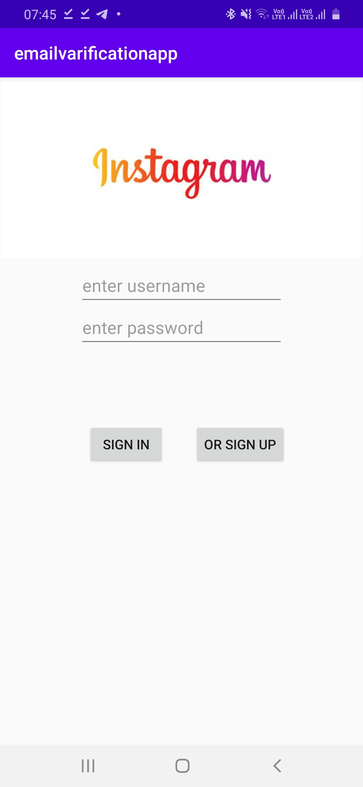          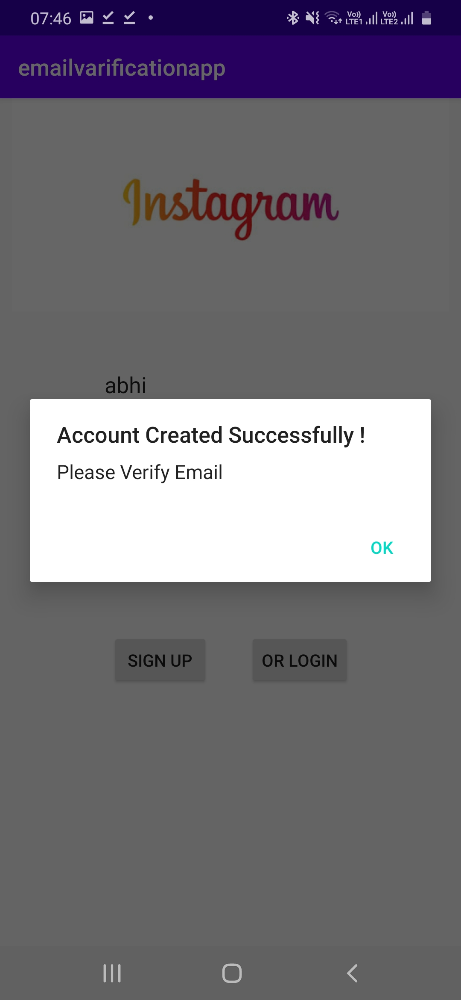
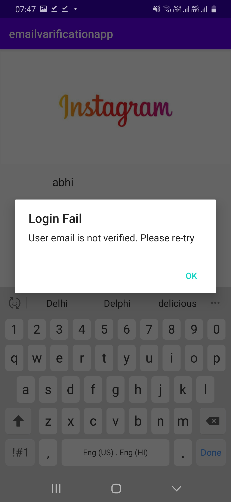
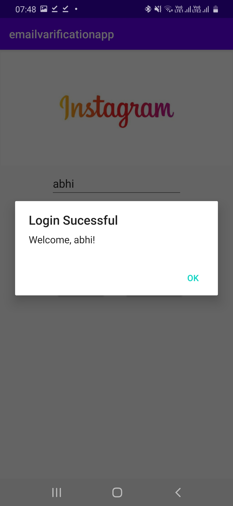
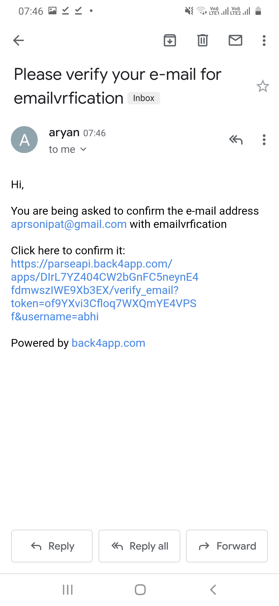

FOLLOW PAGE
a simple follow page is provided where user can kmow who else is using app and follow or unfollow them by simple clicking on them

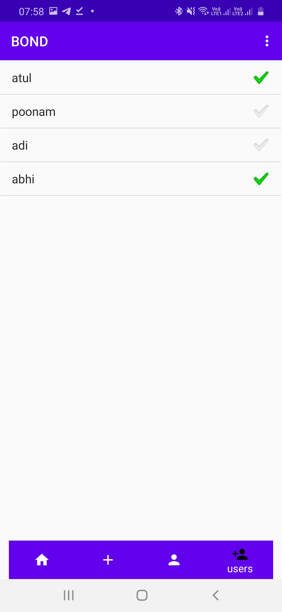

FEED PAGE
user can see the post of users whom he is following in assending order of uploaddate he can see others comment and likes on it and also like and comment it 

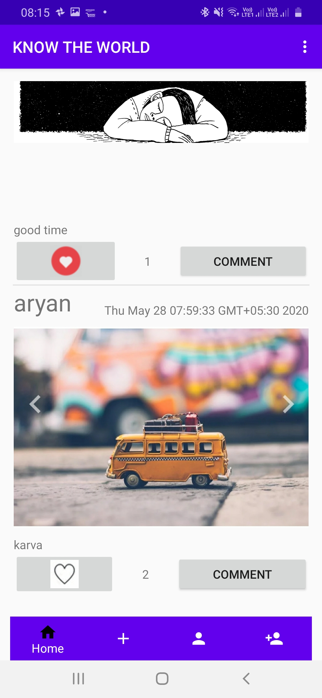

POST PAGE
user can simply upload photo from gallery or any other photo app in his device and add caption to it

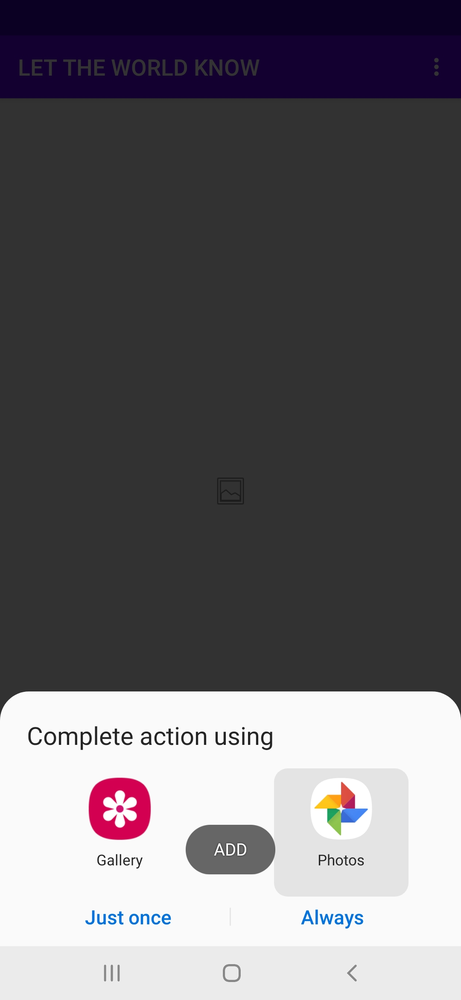          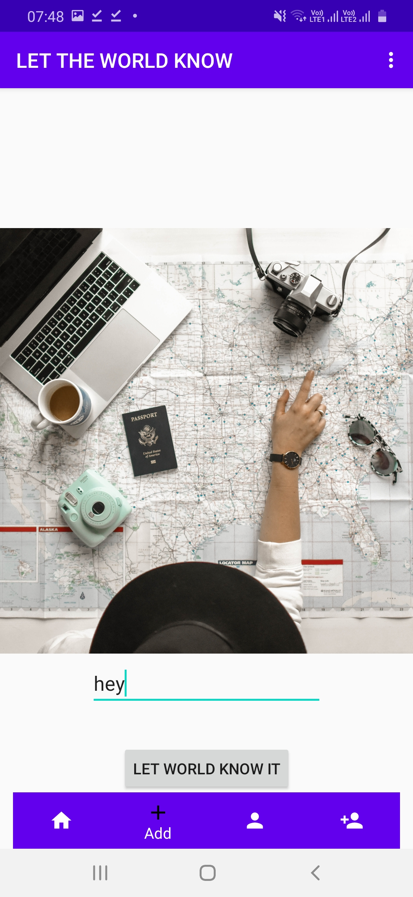

PROFILE PAGE 
here user can keep track of the his post he can check for likes comment as well as delete any post if want

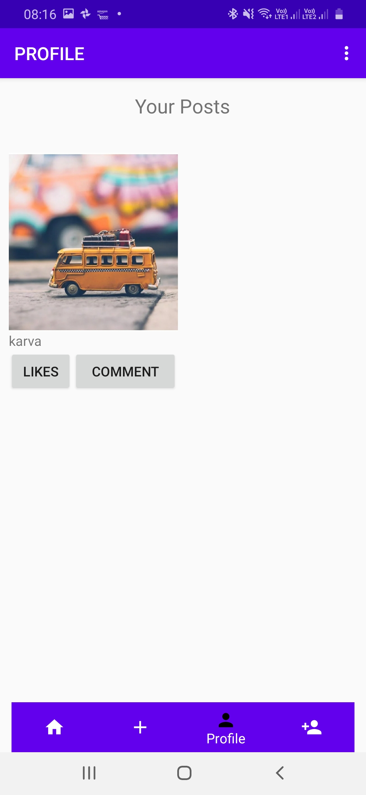           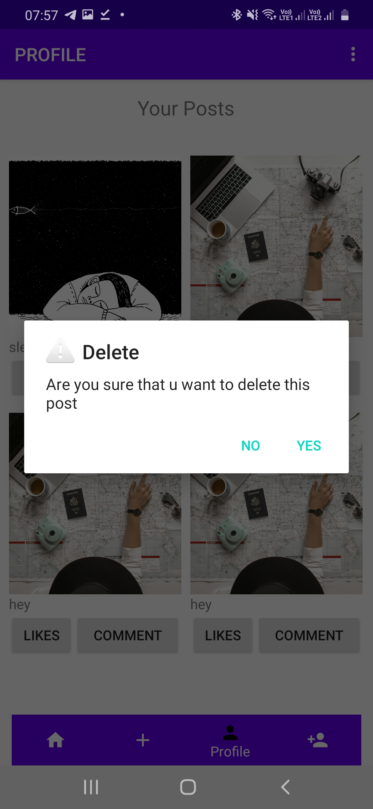

LIKE , COMMENT PAGE

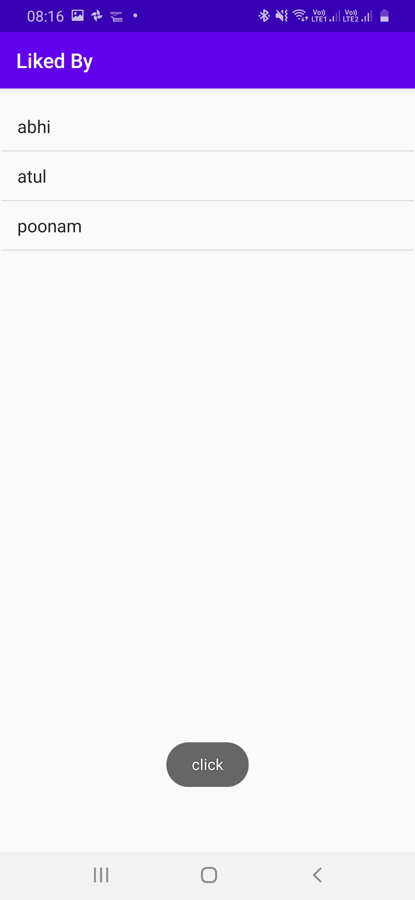             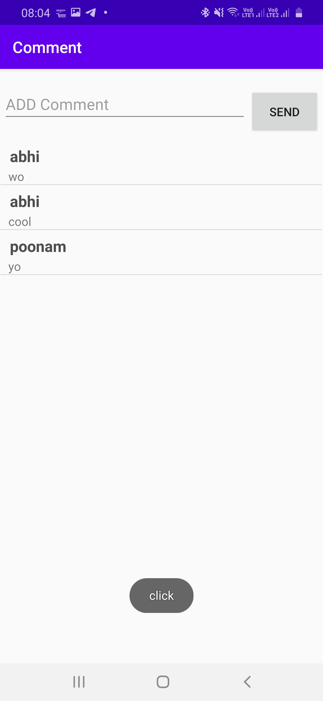

App use parse server

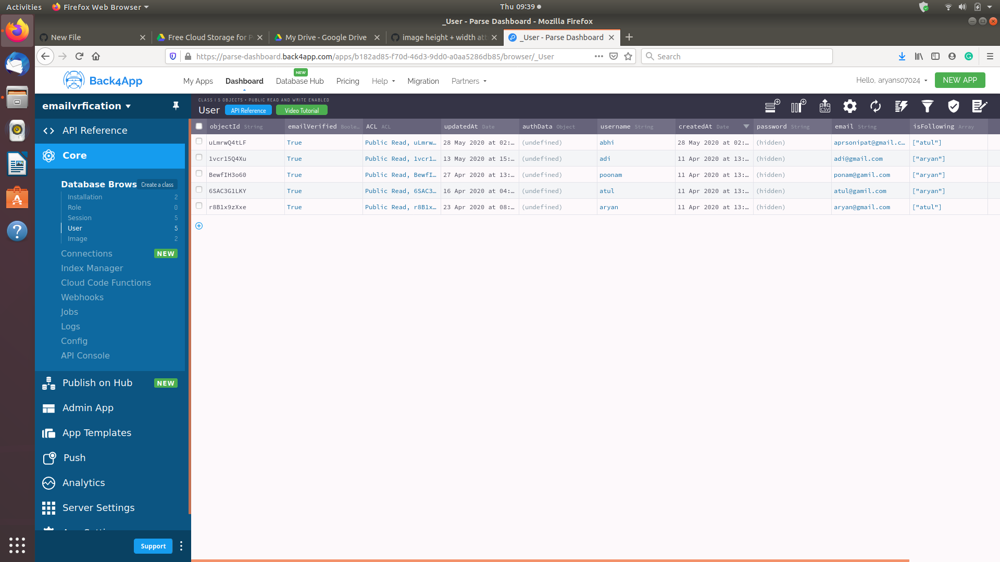          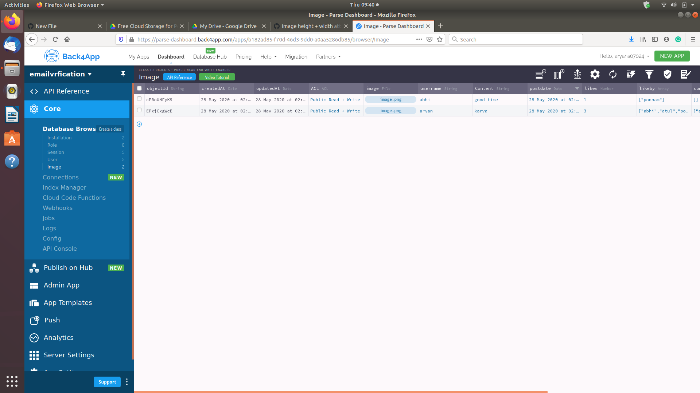
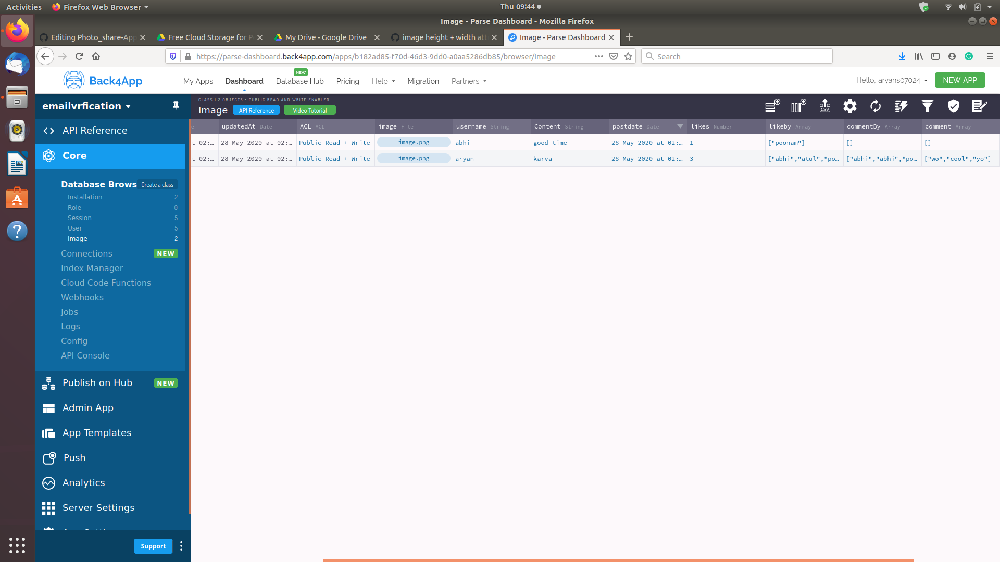
